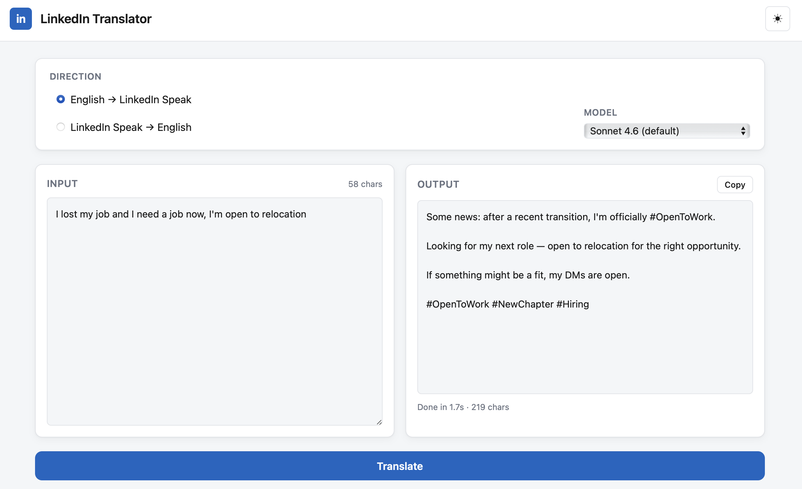
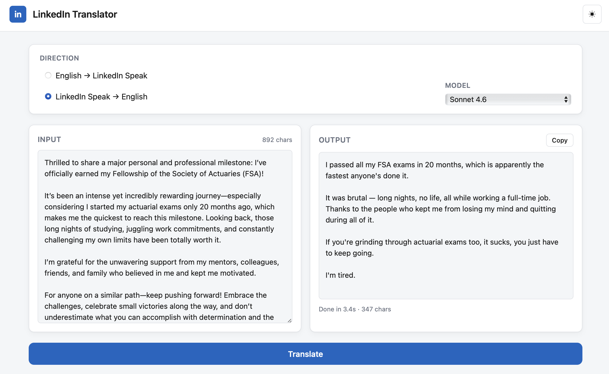

# LinkedIn Translator

A bidirectional translator between plain English and "LinkedIn Speak" — the performative, euphemism-heavy dialect of professional self-promotion. Type "I got fired and I need a job" and get back the appropriate `#OpenToWork #NewChapter #Grateful` post. Paste in a humblebrag and get back what the author probably meant — usually with a quiet "I'm tired" at the end.

Built with FastAPI and the Anthropic Claude API.

## What it looks like

**Plain English → LinkedIn Speak.** Take a normal human statement; receive a viral-formatted post complete with hashtags, mandatory line breaks, and exactly the right amount of manufactured optimism.



**LinkedIn Speak → Plain English.** Strip the performance, keep the substance. A nine-paragraph humblebrag about an actuarial fellowship collapses into the three sentences the author actually meant — including the part they would never post.



## Quick start

```bash
git clone https://github.com/Lomnus-ai/linkedinese.git
cd linkedinese
echo 'ANTHROPIC_API_KEY=sk-ant-...' > .env
uv sync
uv run uvicorn app:app --reload
```

Open <http://localhost:8000> and translate.

There's also a CLI:

```bash
uv run python linkedin_speak.py "I got fired and I need a job"
uv run python linkedin_speak.py --plain "I'm humbled to share that I'm starting a new chapter..."
```

## How it works

Prompt engineering, not a fine-tuned model. Two carefully-tuned system prompts (one per direction) handle the style transfer. Each request:

1. Loads the appropriate system prompt
2. Sends it plus your input to Claude via the Anthropic API
3. Streams the response back to the browser via Server-Sent Events
4. Caches the system prompt server-side using Anthropic prompt caching (~90% off the input prefix on cache hits)

The hard part isn't the LLM call — it's the prompts. They live in:

- **`prompt_en_to_linkedin.md`** — handles when to add #OpenToWork without inventing a fake team to be grateful to. Empty gratitude theater is the #1 tell of an AI-written LinkedIn post, so the prompt is hardened against manufacturing teammates, mentors, durations, or credentials that weren't in the input.
- **`prompt_linkedin_to_en.md`** — decides whether "new chapter" means "got fired" or "quit" based on signal words around it, preserves named entities (companies, dollar amounts, conferences), and ends the right kind of post with a deflated punchline like "I'm tired" or "at least it's over."

Both prompts are heavily annotated with style rules and few-shot examples. They are, in some non-trivial sense, the entire product.

## Models

Pick a model per direction from the dropdown. Defaults are tuned for the difficulty of each direction:

| Direction              | Default       | Why                                                                    |
| ---------------------- | ------------- | ---------------------------------------------------------------------- |
| English → LinkedIn     | Sonnet 4.6    | The easy direction — adding fluff is what LLMs do natively             |
| LinkedIn → English     | Opus 4.7      | The hard direction — needs nuance to decode intent and pick the right deflation |

Haiku 4.5 is also available if you want it cheaper.

## Project layout

```
app.py                         FastAPI web app + /api/translate streaming endpoint
linkedin_speak.py              CLI: linkedin_speak.py "I got fired" / --plain to reverse
prompt_en_to_linkedin.md       System prompt — plain → LinkedIn
prompt_linkedin_to_en.md       System prompt — LinkedIn → plain
run_experiment.py              Offline harness: runs cases.json through every model + LLM judge
cases.json                     Curated and hard-mode test cases for both directions
static/                        Frontend (vanilla HTML/CSS/JS, no build step)
runs/                          Experiment outputs (results.json, summary.md), gitignored
screenshots/                   The pictures above
```

## Constraints

- Rate limit: 10 requests/minute per IP (`slowapi`)
- Max input: 10,000 characters
- The English → LinkedIn direction will refuse to invent facts. If you don't mention a team, it won't thank one. If you don't say how long you worked somewhere, it won't add "after nearly a decade." Generic LinkedIn slop is the failure mode the prompt was built to avoid.

## License

MIT — see [LICENSE](LICENSE).

## Credits

- Anthropic for the model.
- Every overcaffeinated VP of Operations whose Sunday-night announcement post supplied the training intuition.
